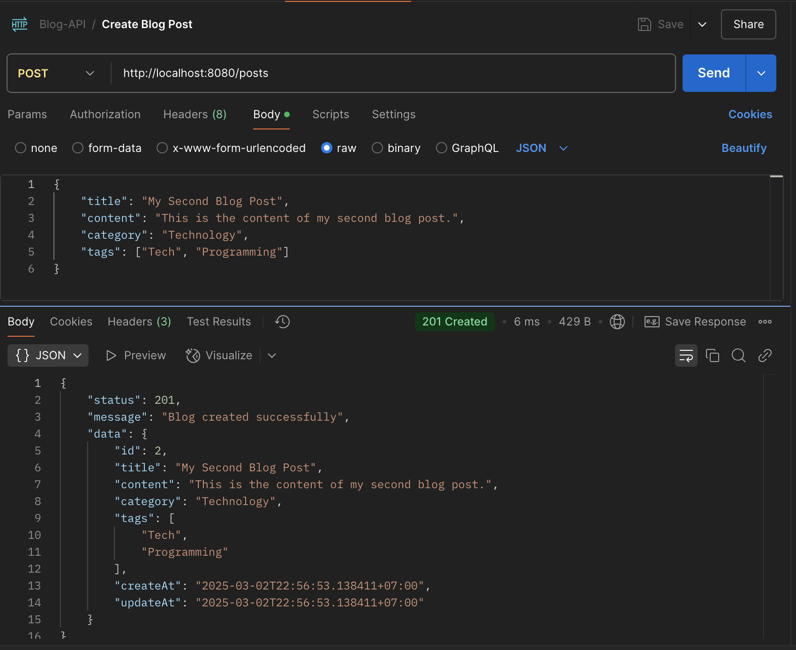

<div align="center" id="readme-top">

  <h1>Blogging Platform API</h1>

  <p>
    A simple RESTful API with basic CRUD operations for a personal blogging platform. </p>
 <p>Built with Go (Gin Gonic, Gorm) and PostgreSQL</p>
   <p>this tool is my implementation of the <a href="https://roadmap.sh/projects/blogging-platform-api">Blogging Platform API</a> challenge from <a href="https://roadmap.sh">roadmap.sh</a>.
  </p>

<!-- Badges -->
<p>
  <a href="https://github.com/vicjeremy/blog-api/graphs/contributors">
    
  </a>
  <a href="">
    
  </a>
  <a href="https://github.com/vicjeremy/blog-api/network/members">
    
  </a>
  <a href="https://github.com/vicjeremy/task-cli/stargazers">
    
  </a>
  <a href="https://github.com/vicjeremy/blog-api/issues/">
    
  </a>
  <a href="https://github.com/vicjeremy/blog-api/blob/master/LICENSE.txt">
    
  </a>
</p>

<h4>
    <a href="https://github.com/vicjeremy/blog-api/issues/">Report Bug</a>
  <span> · </span>
    <a href="https://github.com/vicjeremy/blog-api/issues/">Request Feature</a>
  </h4>
</div>

<br />

<!-- Table of Contents -->

# :notebook_with_decorative_cover: Table of Contents

- [About the Project](#star2-about-the-project)
  - [Screenshots](#camera-screenshots)
  - [Tech Stack](#space_invader-tech-stack)
  - [Features](#dart-features)
- [Getting Started](#toolbox-getting-started)
  - [Prerequisites](#bangbang-prerequisites)
  - [Installation](#gear-installation)
  - [Run Locally](#running-run-locally)
- [Contributing](#wave-contributing)
- [License](#warning-license)
- [Contact](#handshake-contact)
- [Acknowledgements](#gem-acknowledgements)

<!-- About the Project -->

## :star2: About the Project

<!-- Screenshots -->

### :camera: Screenshots

<div align="center">
  
</div>

<!-- TechStack -->

### :space_invader: Tech Stack

- <a href="https://golang.org" target="_blank" rel="noreferrer">[![Go][Go]][Go-url]</a>

<!-- Features -->

### :dart: Features

- Create a new blog post
- Update an existing blog post
- Delete an existing blog post
- Get a single blog post
- Get all blog posts
- Filter blog posts by a search term

<p align="right">(<a href="#readme-top">back to top</a>)</p>

<!-- Getting Started -->

## :toolbox: Getting Started

<!-- Prerequisites -->

### :bangbang: Prerequisites

This project uses Go as its main language. Make sure you have it installed on your machine. If not, you can install it from the official website [here](https://golang.org/).

```bash
  go version
```

<!-- Run Locally -->

### :running: Run Locally

Clone the project

```bash
  git clone https://github.com/vicjeremy/blog-api.git
```

Go to the project directory

```bash
  cd blog-api
```
Preparing .env

```bash
  touch .env
```
Set up database url in .env

```env
  DB_URL="postgresql://<username>:<password>@<ip>:<port>/<database_name>?sslmode=disabled"
```

Run the project

```bash
  go run cmd/main.go
```

<p align="right">(<a href="#readme-top">back to top</a>)</p>

<!-- Usage -->


<!-- Contributing -->

## :wave: Contributing

<a href="https://github.com/vicjeremy/blog-api/graphs/contributors">
  
</a>

Contributions are always welcome!

<p align="right">(<a href="#readme-top">back to top</a>)</p>

<!-- License -->

## :warning: License

Distributed under the MIT License. See [LICENSE.txt](LICENSE.txt) for more information.

<p align="right">(<a href="#readme-top">back to top</a>)</p>

<!-- Contact -->

## :handshake: Contact

Vic Jeremy - [@viccjeremy](https://instagram.com/viccjeremy) - [vicjeremyp@gmail.com](mailto:vicjeremyp@gmail.com)

Project Link: [https://github.com/vicjeremy/blog-api](https://github.com/vicjeremy/blog-api)

<p align="right">(<a href="#readme-top">back to top</a>)</p>

<!-- Acknowledgments -->

## :gem: Acknowledgements

- [Backend Project ideas from roadmap.sh](https://roadmap.sh/backend/projects)

<p align="right">(<a href="#readme-top">back to top</a>)</p>

[Go]: https://img.shields.io/badge/GOlang-00ADD8?style=for-the-badge&logo=go&logoColor=white
[Go-url]: https://golang.org/
